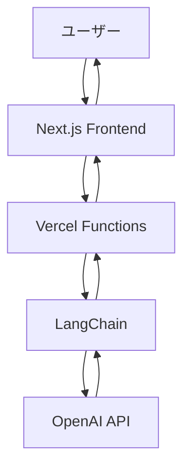

# LangChain × Next.js チャットデモ

OpenAI GPTとLangChainを使用したリアルタイムチャットアプリケーションです。Next.jsフロントエンドとVercel Functionsを使用したサーバーレス構成になっています。

## 🌐 ライブデモ

**公開URL**: https://langchain-next-js-app.vercel.app

## 🚀 機能

- リアルタイムチャット機能
- LangChainによるAI応答生成
- TypeScript対応
- レスポンシブデザイン
- 日本語対応
- サーバーレス環境での動作

## 🛠 技術スタック

### フロントエンド
- **Next.js 14** - Reactフレームワーク
- **TypeScript** - 型安全性
- **React 18** - ユーザーインターフェース

### バックエンド
- **Vercel Functions** - サーバーレス関数
- **LangChain** - AI/LLMオーケストレーション
- **OpenAI API** - GPT-4o-mini
- **Python** - API関数の実装

### インフラ
- **Vercel** - ホスティング・デプロイメント
- **GitHub** - ソースコード管理

## 📁 プロジェクト構成

```
langchain-next-demo/
├── frontend/           # Next.js アプリケーション
│   ├── app/
│   │   ├── page.tsx   # メインチャットページ
│   │   ├── layout.tsx # レイアウトコンポーネント
│   │   └── api.d.ts   # 型定義
│   ├── api/           # Vercel Functions
│   │   ├── chat.py    # チャットAPI
│   │   ├── health.py  # ヘルスチェックAPI
│   │   └── requirements.txt
│   ├── package.json
│   └── tsconfig.json
├── backend/            # ローカル開発用 FastAPI
│   ├── main.py        # ローカル開発サーバー
│   └── requirements.txt
├── CLAUDE.md          # Claude Code用ガイド
├── vercel.json        # Vercel設定
└── README.md
```

## 🚀 Vercelでのデプロイ

### 1. GitHubリポジトリの準備

```bash
git clone https://github.com/kazu5150/Langchain-Next.js-App.git
cd Langchain-Next.js-App
```

### 2. Vercelでのデプロイ

1. [Vercel](https://vercel.com) にサインアップ
2. GitHubアカウントと連携
3. 「New Project」からリポジトリを選択
4. 以下の設定を確認：

```
Root Directory: frontend
Framework Preset: Next.js
Build Command: npm run build (デフォルト)
Output Directory: .next (デフォルト)
Install Command: npm install (デフォルト)
```

### 3. 環境変数の設定

Vercelダッシュボードで以下の環境変数を設定：

```
OPENAI_API_KEY = your_openai_api_key_here
```

### 4. デプロイ完了

設定後、自動的にデプロイが開始され、数分で公開されます。

## 🔧 ローカル開発

### 必要な環境
- Node.js 18以上
- Python 3.8以上
- OpenAI APIキー

### 1. 依存関係のインストール

```bash
# フロントエンド
cd frontend
npm install

# バックエンド（ローカル開発用）
cd ../backend
python -m venv myenv
source myenv/bin/activate  # Windows: myenv\Scripts\activate
pip install -r requirements.txt
```

### 2. 環境変数の設定

`backend/.env` ファイルを作成：
```bash
OPENAI_API_KEY=your_openai_api_key_here
```

### 3. ローカル起動

```bash
# バックエンド
cd backend
source myenv/bin/activate
python main.py
# → http://localhost:8000

# フロントエンド（別ターミナル）
cd frontend
npm run dev
# → http://localhost:3000
```

## 🌐 API エンドポイント

### GET /api/health
ヘルスチェック用エンドポイント

**レスポンス:**
```json
{
  "ok": true
}
```

### POST /api/chat
チャット機能のエンドポイント

**リクエスト:**
```json
{
  "user_message": "こんにちは"
}
```

**レスポンス:**
```json
{
  "reply": "こんにちは！何かお手伝いできることはありますか？"
}
```

## 🔄 開発コマンド

### フロントエンド
```bash
npm run dev      # 開発サーバー起動
npm run build    # プロダクションビルド
npm run start    # プロダクションサーバー起動
npm run lint     # ESLint実行
```

### バックエンド（ローカル開発）
```bash
python main.py   # FastAPIサーバー起動
```

## 🔒 セキュリティ

- 環境変数ファイル（`.env`, `.env.local`）は`.gitignore`で除外済み
- CORS設定によりVercelドメインからのアクセスのみ許可
- OpenAI APIキーはサーバーサイドでのみ使用
- Vercel Functions内で安全に環境変数を管理

## 🏗 アーキテクチャ



## 📊 パフォーマンス

- **Vercel Edge Network**: 世界中での高速配信
- **サーバーレス**: 自動スケーリング
- **Next.js**: 最適化されたReact体験
- **コールドスタート**: 最小限の遅延

## 🤝 コントリビューション

1. このリポジトリをフォーク
2. 機能ブランチを作成 (`git checkout -b feature/amazing-feature`)
3. 変更をコミット (`git commit -m 'Add amazing feature'`)
4. ブランチにプッシュ (`git push origin feature/amazing-feature`)
5. プルリクエストを作成

## 📝 ライセンス

このプロジェクトはMITライセンスの下で公開されています。

## 🐛 トラブルシューティング

### Vercelデプロイメント

**1. ビルドエラー**
- Root Directory が `frontend` に設定されているか確認
- 環境変数 `OPENAI_API_KEY` が正しく設定されているか確認

**2. API 404エラー**
- `/frontend/api/` ディレクトリにAPI関数が存在するか確認
- Vercel Functions タブでデプロイされた関数を確認

**3. OpenAI APIエラー**
- APIキーの有効性を確認
- 使用量制限に達していないか確認

### ローカル開発

**1. CORS エラー**
- フロントエンドが http://localhost:3000 で起動しているか確認
- バックエンドが http://localhost:8000 で起動しているか確認

**2. モジュールエラー**
- 仮想環境が有効化されているか確認
- `pip install -r requirements.txt` を再実行

## 🚀 今後の改善予定

- [ ] チャット履歴の保存機能
- [ ] ユーザー認証機能
- [ ] 複数のAIモデル対応
- [ ] リアルタイム通信（WebSocket）
- [ ] マークダウン対応
- [ ] ファイルアップロード機能